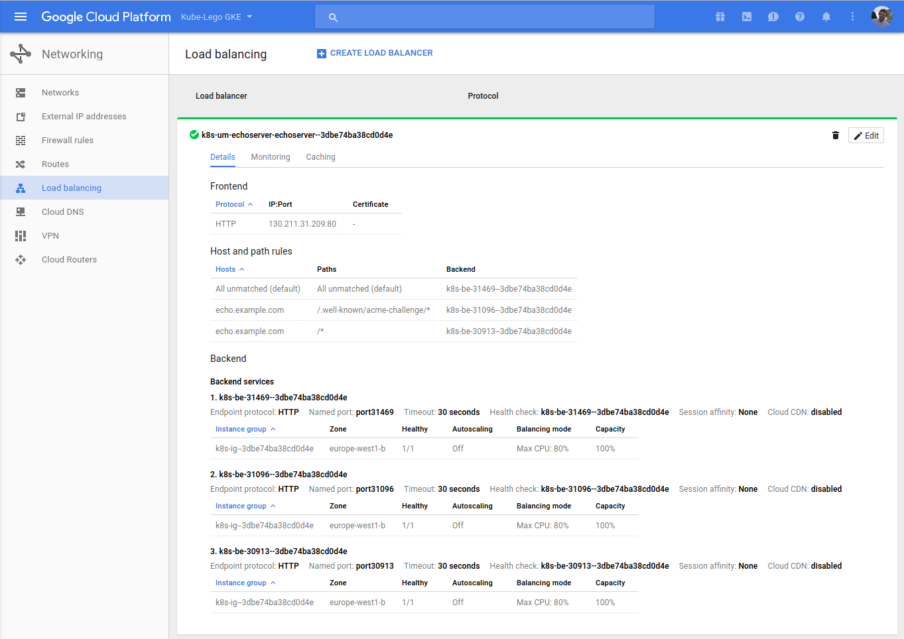

# kube-lego with GCE ingress controller

With using GKE/GCE ingress controller you hand off the HTTP routing to GCE
 
This examples runs kube-lego in a separate namespace

# Create the kube-lego related objects

```bash
# Namespace
kubectl create -f 05-kube-lego-namespace.yaml
# ConfigMap
kubectl create -f 20-kube-lego-configmap.yaml
# Deployment
kubectl create -f 50-kube-lego-deployment.yaml
```

# Create an example application `echoserver` in a separate namespace 

```bash
# Namespace
kubectl create -f 05-echoserver-namespace.yaml
# Service (has to be Type=NodePort)
kubectl create -f 20-echoserver-svc.yaml
kubectl create -f 50-echoserver-deployment.yaml
kubectl create -f 70-echoserver-ingress.yaml
```

As soon as the `ingress/echoserver` resource is added to the cluster, kube-lego will be aware of that and try to get a certificate for the domain `echo.example.com` specified in the ingress resource. Please be aware that you have to manually point the DNS record for `echo.example.com` to the the load balancer created.

You get the right IP address by using kubectl. (It can take a minute until your load balancer is created):

```bash
kubectl get ingress --namespace echoserver echoserver
NAME         HOSTS              ADDRESS          PORTS     AGE
echoserver   echo.example.com   130.211.31.209   80, 443   2m
```

# Screenshot of GCE console

If you take a look at the load balancers in GCE it should look like that


